# Quoi de neuf dans Visual Studio 2017
Survol de nouvelles fonctionnalités de Visual Studio 2017

## Mise en contexte
Le 7 mars 2017 nous a amené la version 2017 de Visual Studio, toujours disponible en version Community, Professional et Enterprise.

Voici donc les fonctionnalités qui ont retenu notre attention et qui vont fort probablement vous aider dans vos projets.

## L'installation
Avant même de parler de ce que Visual Studio 2017 va vous apporter, on peut parler de l'installateur, qui a été complètement refait. Il est maintenant plus facile de sélectionner individuellement les composantes que nous avons besoin, ou encore de les ajouter via des "Workloads", qui sont essentiellement des regroupements de composantes nécessaires selon certains besoins. 
Par exemple, et vous pouvez le constater avec les captures d'écran ci-bas, le workload "Universal Windows Platform development" nous sélectionnera les versions du framework, le compilateur et tous les outils nécessaires à ce type de projet.

##### Workloads
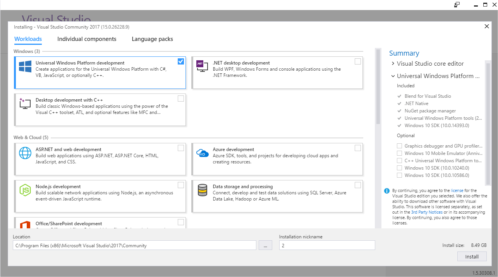

##### Composantes
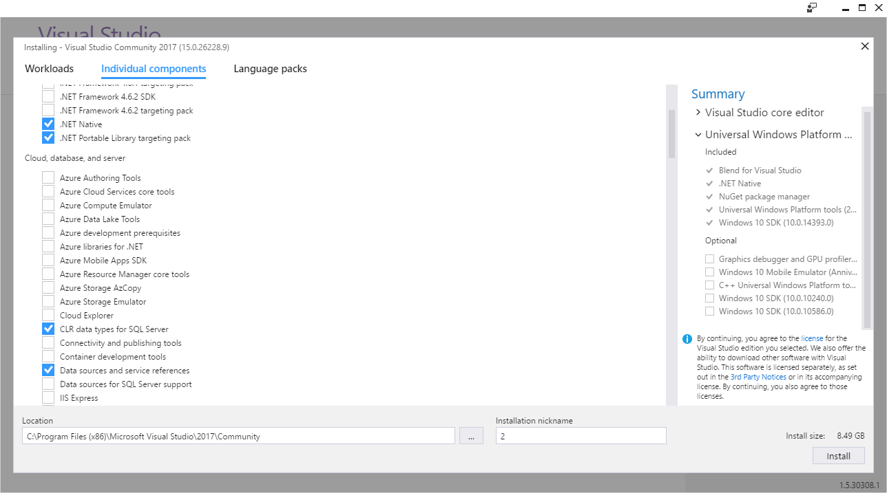

Un autre élément qu'on peut noter (que vous pouvez voir sur les captures) est qu'il est possible de donner un "nickname" à notre installation. Puisqu'il est possible d'installer deux versions de Visual Studio 2017 sur le même ordinateur (Community et Professional, par exemple), il est donc possible de donner un surnom à l'installation, pour permettre de facilement les distinguer dans le menu de démarrage.

## Améliorations de l'IDE
Une des plus grandes améliorations qu'on peut voir dans cette nouvelle version est la performance. Un gros travail d'optimisation a été fait pour réduire le temps de démarrage et le temps de chargement des solutions. Selon Microsoft, le temps de démarrage serait 50% plus rapide qu'avant lors de la première utilisation.
Pour bien le constater, j'ai fait le test de comparer l'ouverture d'une solution sur laquelle j'ai travaillé récemment, qui contenait 15 projets. Pour un temps d'ouverture d'environ 10 secondes avec Visual Studio 2015, on passait à seulement 6 secondes avec la version 2017. 
Malgré cette différence assez notable, je me suis demandé si l'option de "Lightweight Solution Load", qui a été ajoutée pour permettre de charger plus rapidement et pour mieux utiliser la mémoire, pourrait me permettre d'améliorer ce temps. J'ai donc activé l'option pour ma solution (cette option n'est pas activée par défaut) et refait le test, pour en arriver à un temps d'ouverture de 3 secondes. L'idée en arrière de cette option est de ne pas totalement charger les projets de la solution tant qu'on ne commence pas à les utiliser. La navigation à travers le code pourra donc se faire très rapidement après le démarrage, et il ne sera pas nécessaire d'atteindre que nos 15 projets soient chargés avant de commencer à travailler dans celui où nous voulons faire du code.
Je vous laisse le soin de faire le test avec vos solutions, mais je crois qu'on peut considérer l'objectif de performance comme atteint !

## Page de démarrage
Beaucoup de changements sur cette page qui nous est offerte à l'ouverture de l'application. 
Un premier changement, quoique mineur, est la possibilité de cacher la section "Developer News". Pour ceux qui ne consultent pas ces nouvelles, cela permettra de laisser toute la place aux récents projets et à la création de nouveaux.
Parlant de nouveaux projets, nous avons là un changement qui sera selon moi le bienvenue pour beaucoup de gens. Dans les versions précédantes de Visual Studio, la création d'un nouveau projet nous ouvrait tout simplement le dialogue de sélection de gabarit de projet. 

Avec 2017, une section de la page est maintenant dédiée à la création de projets, en nous permettant de choisir parmis les gabarits de projets récemment utilisés 
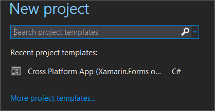

ou encore avec la barre de recherche de gabarit.
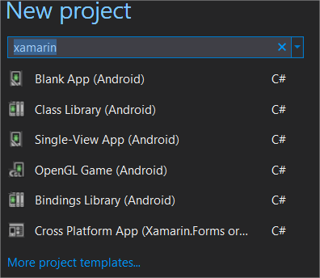

Dans la majorité des cas, il sera donc possible de démarrer un nouveau projet directement à partir de cet écran.

## Navigation de code
Beaucoup de choses ont été mises en place pour améliorer la navigation dans notre code.

##### Go To All
La première est la fonction de "Go To All", qui nous amène ce dialogue de recherche:
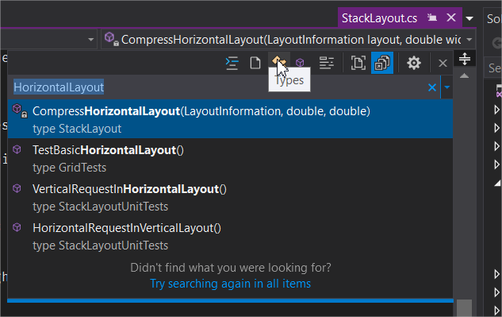

Il est donc possible à partir de cette barre de recherche de chercher à travers tous les types, membres, fichiers et d'accéder à la classe. Plus besoin de naviguer vers la classe en passant par l'explorateur de solution, tout pourra se faire sans que nos doigts quittent le clavier.

##### Find All References
Le panneau pour trouver toutes les références est fréquemment utilisé pour avoir une liste de toutes les références à une classe ou un objet. 
Jusqu'à Visual Studio 2017, cette liste de résultats pouvait nous donner l'information sur le projet et le fichier où la référence était, mais simplement par le texte contenu dans la ligne affichée sur la référence.

Souhaitons donc la bienvenue à ce panneau, version améliorée:
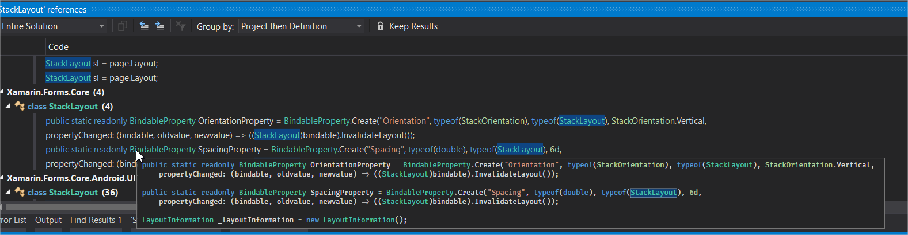

On peut tout d'abord remarquer qu'il est possible de grouper les résultats de la recherche. Cette capture montre un groupement par projet puis par définition, mais plusieurs autres options s'offrent à nous pour grouper selon nos besoins.
On remarque aussi la colorisation des résultats, pour aider à comprendre le contexte de la référence qui nous est affichée, qu'on retrouve également dans l'affichage de l'extrait du code entourant la référence.

##### Structure Guide Lines
Dans sa plus simple utilisation, cette fonctionnalité nous permet d'avoir un indicatif visuel pour nous aider à visualiser la strucutre de notre code. La valeur ajoutée de ceci nous vient lorsqu'on dépose le curseur de notre souris sur ces lignes. En effet, une info-bulle nous sera affichée, avec le début de notre bloc de code et de ses blocs parents. Il est donc possible de voir facilement le contexte de notre bloc de code, sans avoir à naviguer de bas en haut et de haut en bas dans notre fichier.
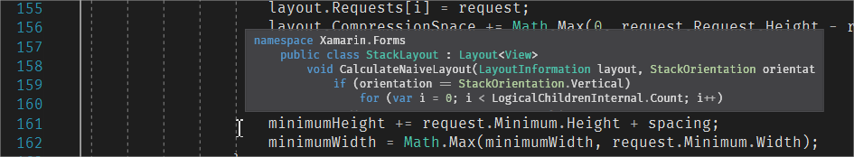

## Ouverture de dossiers
La polyvalence faisant partie intégrale de notre métier, il arrive parfois que nous devons travailler sur autre chose qu'une solution faite en .NET. Avec cette nouvelle version de Visual Studio, il nous est maintenant possible d'ouvrir le dossier de ces projets (un projet PHP par exemple), et d'y travailler, avec surbrillance de la syntaxe et beaucoup de fonctionnalités comme la navigation et la recherche à travers le dossier.

Il est même possible d'ouvrir un dossier dans Visual Studio directement à partir de l'explorateur de fichier, avec une nouvelle commande ajoutée au menu contextuel. 

## Actions rapides et refactoring
Plusieurs options de refactoring se sont ajoutées avec cette nouvelle version, dont certaines reliées aux changements que C#7 apporte. En voici quelques-unes qui ont retenu mon attention, puisqu'avant, il nous était seulement possible de bénéficier de celles-ci avec l'aide d'un outil additionnel comme Resharper.

##### Simplifier l'initialisation de variables avec un initialiseur
Lorsqu'on a un objet à initialiser avec plusieurs propriétés, il est préférable d'utiliser l'initialiseur, pour vraiment encapsuler l'initialisation de notre variable, et pour éviter de répéter le nom de la variable inutilement. L'option de refactoring vient donc nous aider à rapidement mettre ceci en place, comme vous pouvez le voir avec cette capture d'écran:

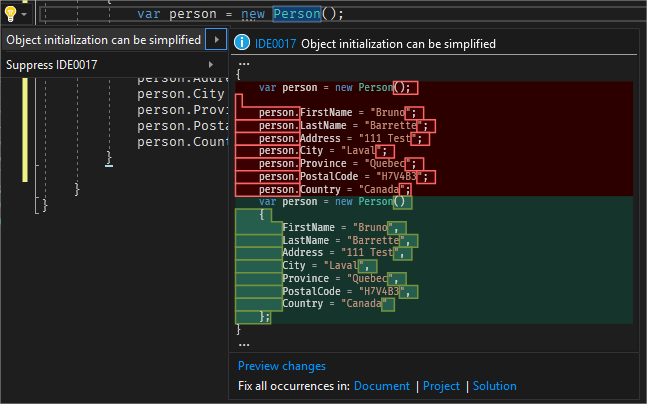


##### Déplacer les variables "out" inline
Une des nouvelles fonctionnalités de C#7 est de pouvoir déclarer les variables "out" directement dans la fonction l'utilisant (un TryParse, par exemple). L'option de refactoring nous est donc offerte par Visual Studio pour simplifier ceci:

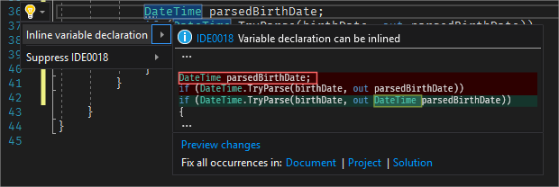


##### Utilisation des expressions de Throw
Une autre des nouvelles fonctionnalités de C#7 est de pouvoir directement lancer une exception avec l'opérateur de fusion Null (null-coalescing), au lieu du traditionnel "if" qui vérifie si la variable est nulle. Visual Studio nous offre donc l'option de faire le refactoring là-dessus, comme démontré ci-dessous:

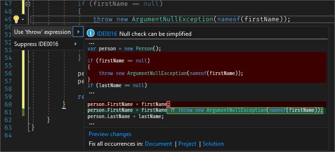


##### Déplacer un type vers un fichier correspondant
Il nous arrive parfois, dans le feu de l'action, de déclarer plus d'un type à l'intérieur du même fichier. Avant Visual Studio 2017, pour le déplacer, nous devions passer par l'ajout d'un item dans notre projet, nommé de la même manière que le type en question, couper notre type déclaré et le coller à l'intérieur du nouveau fichier créé, écrasant la déclaration vide. Maintenant, il nous suffit d'utiliser l'option de refactoring que Visual Studio nous offre et le tout se fera automatiquement.

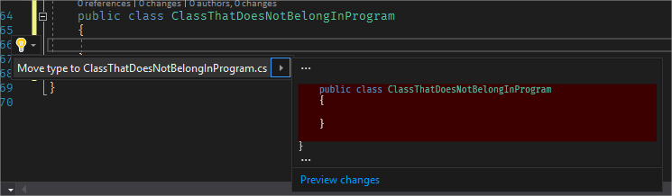


##### Synchroniser le nom d'un fichier et d'un type
Il nous arrive tous à un moment ou un autre de devoir renommer une classe, et pour garder le nom du fichier identique, il fallait manuellement renommer le fichier au niveau de l'explorateur de solution. Nous avons maintenant la possibilité de faire l'opération de synchroniser les deux, d'un côté comme de l'autre, directement à partir des options de refactoring:

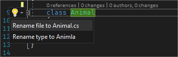


##### Conversion de String.Format en interpolation de chaîne
C#6 nous avait amené la fonction d'interpolation de chaîne, qui nous permet d'écrire une chaîne de caractères en y insérant des variables inline, au lieu du traditionnel String.Format:

```csharp
var name = $"Mon nom est {person.FirstName} {person.LastName}";
```

Il nous est donc possible d'utiliser ceci depuis quelques temps déjà, mais l'option de refactoring vers l'interpolation n'était pas disponible, à moins d'avoir un outil (et des coûts supplémentaires) comme Resharper. Aujourd'hui, l'option nous est finalement accessible:

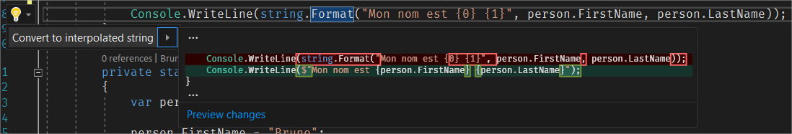

## Filtres sur l'IntelliSense
Une grande amélioration au niveau de l'IntelliSense nous permet maintenant de filtrer ce qui nous est affiché, pour par exemple voir seulement les classes, les structures, ou encore les variables locales. Ces options de filtres sont d'ailleurs accessibles avec des raccourçis de clavier, donc tout ceci peut se faire sans que nos mains quittent le clavier.

## Débogage

##### Run to click
Le temps est breakpoint temporaires, qui servaient seulement à nous amener à un endroit précis lors de débogages, est révolu. Du moment où nous sommes en état d'arrêt à l'intérieur du code, un icône sera accessible à gauche de n'importe quelle ligne où on met notre curseur, et en un simple clic, l'exécution se fera jusqu'à cette ligne:

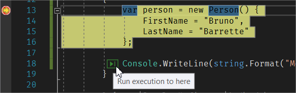

## Assistant d'exception amélioré
Le premier changement que vous pourrez remarquer avec cette nouvelle version d'assistant d'exception est que la fenêtre n'est plus modale.

Un autre aspect très utile concerne les exceptions imbriquées, qui sont maintenant accessibles directement à partir de l'assistant. Plus besoin d'ouvrir l'objet de l'exception pour aller voir sa propriété InnerException (et potentiellement ses exceptions imbriquées).

## Le Roaming Extension Manager
Nous avons tous certaines extensions de Visual Studio que nous utilisons partout où nous allons, qu'il faut réinstaller chaque fois qu'on accède un nouveau poste, ou encore si on doit réinstaller notre ordinateur. Grâce au Roaming Extension Manager, les extensions que nous désignerons pour être "roaming" seront automatiquement synchronisées dans le cloud et réinstallées dès que vous serez connectés à votre compte Visual Studio.

## Conclusion
Ces changements ne sont qu'une partie des changements que Visual Studio 2017 nous amène. Mais avec le petit survol que nous venons de faire, je crois qu'il est facile de constater que beaucoup d'efforts ont été mis pour améliorer notre expérience d'utilisation et nous faciliter la vie dans notre travail au quotidien.